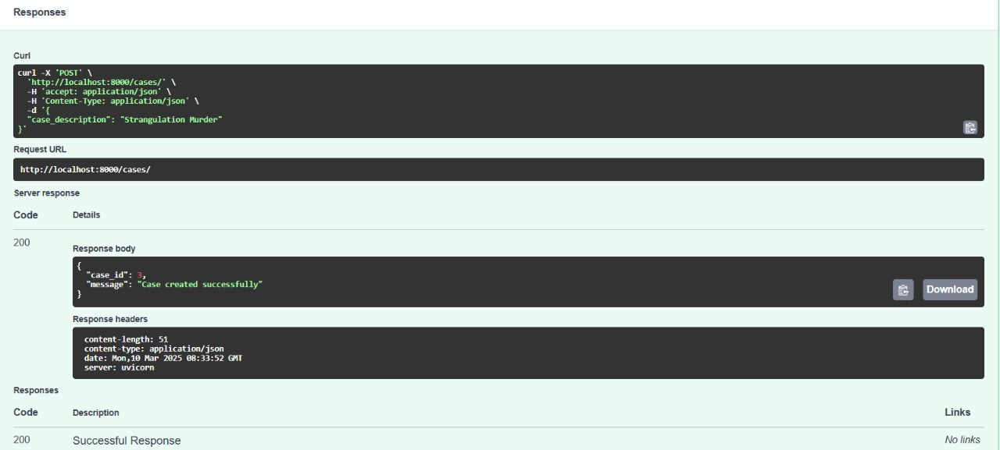
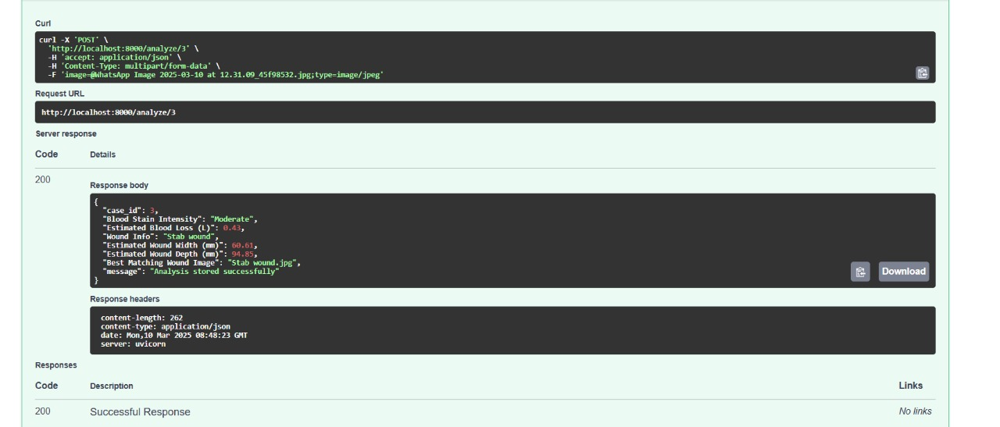

# Forensic 360 - Crime Investigation Platform

Forensic 360 is a cutting-edge crime investigation platform that integrates machine learning, forensic analysis, and 3D crime scene visualization. The system is designed to enhance crime scene reconstruction, blood spatter analysis, and wound dimension estimation using AI-powered tools.

## 🚀 Project Overview

Forensic 360 provides:
- **Case Management System** to store and manage crime-related data.
- **Blood Spatter Analysis** using a trained CNN model to classify blood stain intensity.
- **Wound Analysis** to estimate wound dimensions and match them to the dataset.
- **Machine Learning Integration** for forensic assistance.
- **3D Visualization** with Three.js for interactive crime scene reconstruction.

## 🏗️ Tech Stack
- **Backend**: FastAPI, Python, Torch, OpenCV, MySQL
- **Frontend**: React.js, Three.js (Three Fiber) for 3D visualization
- **Database**: MySQL
- **AI Models**: Custom CNN for blood spatter analysis, wound dataset for injury classification

## 📂 Project Structure
```
backend/
│── app/
│   │── __pycache__/
│   │── WoundDataset/ (Dataset for wound analysis)
│   │── blood_spatter_model.pt (Trained ML model for blood stain classification)
│   │── main.py (API server)
│   │── wound_analysis.py (Wound analysis functions)
│── venv/ (Virtual environment)
│── requirements.txt (Dependencies)
frontend/
│── gmod-viewer/ (React.js + Three.js for 3D model rendering)
│── .gitignore
│── Readme.md
```

## 🛠️ Installation & Setup

### Backend Setup
1. Clone the repository:
   ```sh
   git clone https://github.com/yourusername/forensic-360.git
   cd forensic-360/backend
   ```
2. Set up a virtual environment:
   ```sh
   python -m venv venv
   source venv/bin/activate  # On Windows: venv\Scripts\activate
   ```
3. Install dependencies:
   ```sh
   pip install -r requirements.txt
   ```
4. Run the FastAPI server:
   ```sh
   uvicorn app.main:app --reload
   ```
5. The API will be available at: [http://127.0.0.1:8000/docs](http://127.0.0.1:8000/docs)

### Frontend Setup (3D Model Viewer)
1. Navigate to the frontend directory:
   ```sh
   cd frontend/gmod-viewer
   ```
2. Install dependencies:
   ```sh
   npm install
   ```
3. Start the React app:
   ```sh
   npm start
   ```
4. The 3D Viewer will be available at: `http://localhost:3000`

## 📌 API Endpoints

### Case Management
- **Create a new case**
  ```http
  POST /cases/
  ```
  **Request Body:**
  ```json
  {
    "case_description": "Homicide case at location XYZ"
  }
  ```
  **Response:**
  ```json
  {
    "case_id": 1,
    "message": "Case created successfully"
  }
  ```

- **Delete a case**
  ```http
  DELETE /cases/{case_id}
  ```
  **Response:**
  ```json
  {
    "message": "Case and associated analysis deleted successfully"
  }
  ```

### Blood Spatter Analysis
- **Analyze an image for blood stain intensity**
  ```http
  POST /analyze/{case_id}
  ```
  **Request:** Upload an image file
  **Response:**
  ```json
  {
    "case_id": 1,
    "Blood Stain Intensity": "High",
    "Estimated Blood Loss (L)": 0.35,
    "Wound Info": "Deep stab wound",
    "Estimated Wound Width (mm)": 25.4,
    "Estimated Wound Depth (mm)": 12.7,
    "Best Matching Wound Image": "wound_sample_5.jpg",
    "message": "Analysis stored successfully"
  }
  ```

## 🔬 AI Models Used
- **Blood Spatter Model** (CNN-based classifier trained on forensic datasets)
- **Wound Analysis Model** (Estimates wound dimensions and matches with dataset)

## 📊 3D Crime Scene Reconstruction
The `gmod-viewer` React.js app uses **Three.js** to visualize crime scenes with `.glb` 3D models.

## Screenshots

### Crime Cases


### Wound Analysis



## 🔒 Security & Privacy
- **API Authentication**: To be implemented in production.
- **Data Encryption**: Secure storage for crime case data.
- **Privacy Compliance**: Ensures sensitive forensic data is protected.

## 👨‍💻 Contributors
- **Emmanuel Matthew** 
- **Mohan B**
- **Swetha G**
- **Wilson Bernard**

- Open to contributions! Feel free to fork the repo and submit PRs.

## 📜 License
This project is licensed under the MIT License.

---

Forensic 360 is a next-gen forensic toolkit that aims to bridge the gap between law enforcement and technology. 🚔🔬